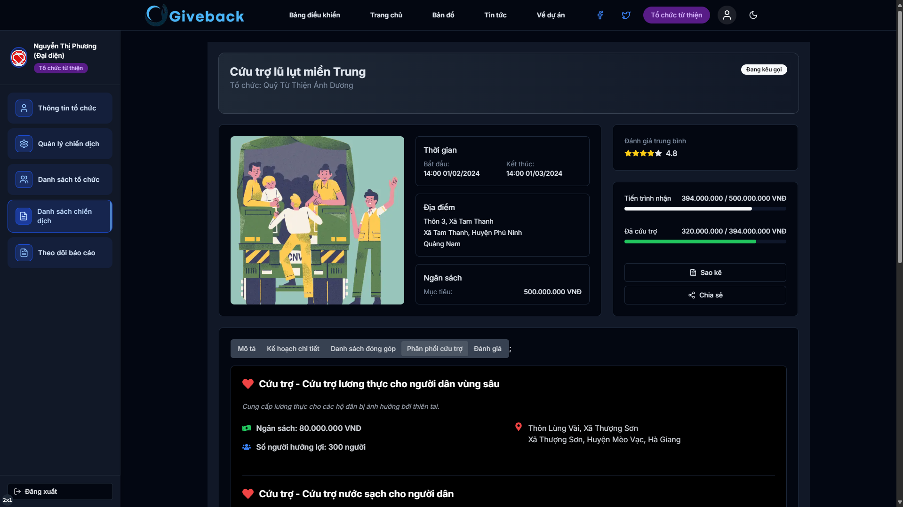
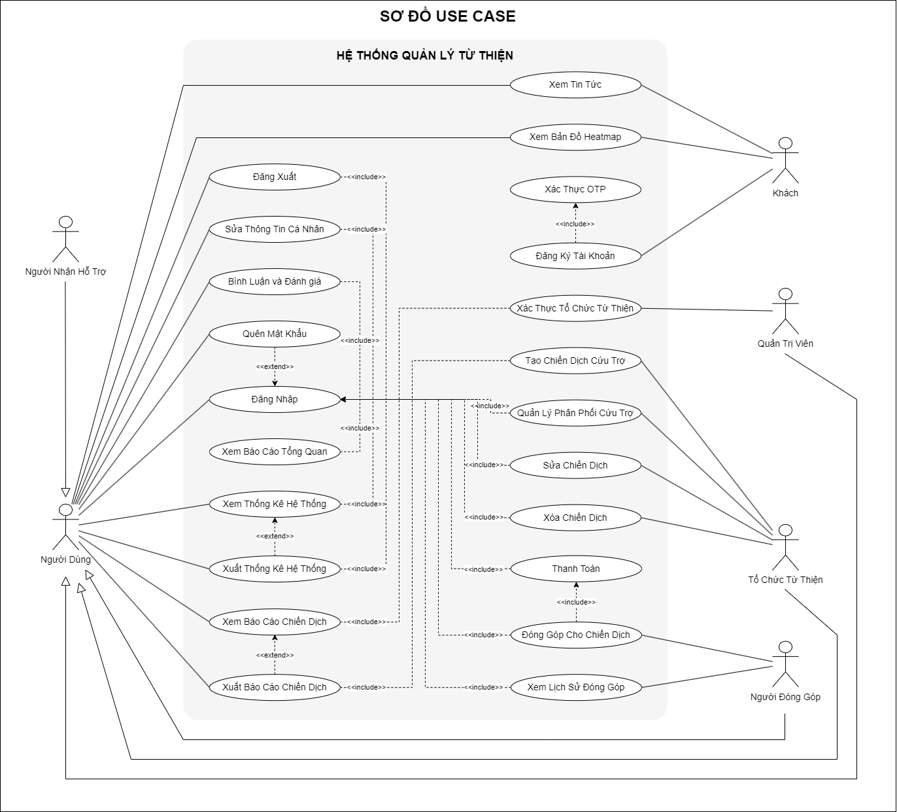

# GIVEBACK Backend

## Introduction

**Project Notice:** This project was developed as a coursework assignment and completed within 15 days. While functional, it may contain limitations and areas for improvement due to the time constraints.

GIVEBACK Backend is the core component of the charitable donation platform supporting disaster-affected areas in Vietnam. This system manages users, charity campaigns, processes donations, and generates transparent reports on fund utilization. With a design that ensures scalability and security, GIVEBACK Backend ensures that transactions and data are managed efficiently and reliably.



We welcome contributions from the community to make this platform practical and effectively support Vietnamese people affected by natural disasters.

## Main Features



### 1. Account Registration and Authentication
- **Account Registration:**
  - Users can register with roles: DONOR, CHARITY, or BENEFICIARY.
  - Account verification via OTP sent to phone number.

- **CHARITY Account Verification:**
  - Charitable organizations need to provide operating licenses.
  - Admin reviews and verifies licenses before changing status to VERIFIED.

### 2. Charity Campaign Management
- **Create New Campaign (CHARITY):**
  - Must be verified by Admin before creation.
  - Manage campaign information such as description, objectives, budget, location, and time.

- **Update and Delete Campaigns:**
  - Charitable organizations can edit or delete campaigns under their management.
  - System automatically handles related data when campaigns are deleted.

### 3. Charitable Donations
- **Process Donations:**
  - Integrate payment methods such as bank transfers, E-wallets (Momo, VNPAY), and credit cards.
  - Update transaction status based on payment gateway responses.

### 4. Tracking and Reporting
- **Report Management:**
  - Provide overview information about donated money and goods, distribution, and remaining balance.
  - Support detailed report export by person, day, month, charitable organization, and disaster.

### 5. Feedback and Reviews
- **Feedback Management:**
  - Allow users to send feedback and reviews about donation and support reception situations.
  - Display feedback to build community trust.

## Technologies Used
- **Backend:**
  - Node.js, Express.js, TypeScript, PostgreSQL, Sequelize.

- **Payment:**
  - ZaloPay API.

- **Other Tools:**
  - Nodemon, Docker, Docker Compose, Git, ESLint, Prettier.

## Installation and Running the Application

### Requirements
- **Node.js** v14+
- **npm** or **yarn**
- **PostgreSQL**
- **Docker** & **Docker Compose**

### Step 1: Clone Repository
```sh
git clone https://github.com/CaoQuocViet/giveback-server.git
```

### Step 2: Install Dependencies
```sh
cd giveback-server
npm install
# or
yarn install
```

### Step 3: Environment Configuration
Copy the .env.example file to .env and update the necessary environment variables.

### Step 4: Initialize and Migrate Database
```sh
npm run migrate
npm run seed
# or
yarn migrate
yarn seed
```

### Step 5: Run Application
```sh
npm run dev
# or
yarn dev
```

- The application will run on http://localhost:5000.

## Contributing
We welcome all contributions from the community. To contribute:

1. **Fork the repository.**
2. **Create a new branch** for the feature or bug fix you want to add.
3. **Submit a Pull Request** with detailed description of your changes.

## License
This project is licensed under the MIT License. See the LICENSE file for more details.

## Contact
For any questions or support, please contact us via email: vietcao10@gmail.com.

## Repository Links
- **Frontend:** https://github.com/CaoQuocViet/giveback
- **Backend:** https://github.com/CaoQuocViet/giveback-server